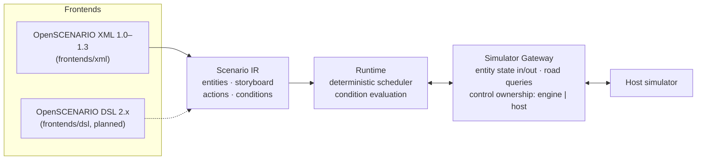

-----

# Scena

**Scena** is the scenario execution engine of the Robomous toolchain — the
stage where scenario actors perform.

It is an open-source (Apache-2.0) scenario execution engine for autonomous-driving
simulation, developed by [Robomous](https://robomous.ai). It executes scenarios
described in **ASAM OpenSCENARIO XML (1.0–1.3)** and, in later phases, **ASAM
OpenSCENARIO DSL (2.x)** — closing the current gap of a native C++ execution
engine for the DSL.

- **Library first.** An embeddable C++20 library with a stable C API and
  Python bindings. Players and CLI tools are thin consumers of that API.
- **Two frontends, one runtime.** OpenSCENARIO XML and OpenSCENARIO DSL
  compile into a common intermediate representation (the *Scenario IR*); a
  single deterministic runtime executes the IR.
- **The simulator owns the clock.** Step-based API
  (`init → step(dt) → query/report state → close`). No internal threads, no
  imposed main loop. Per-entity control ownership: each entity is driven
  either by the engine (default behavior) or by the host simulator (external
  control).
- **Standards correctness.** Behavior is implemented against the ASAM
  OpenSCENARIO specifications, which are the sole normative reference.

## Architecture



The C API (`capi/`) and the Python package (`python/`) wrap the C++ core; the
core depends on nothing above it.

## Quickstart

Requirements: CMake ≥ 3.24, a C++20 compiler, Python ≥ 3.9 (for the
bindings). Dependencies are fetched automatically and pinned.

```sh
# Build and run the C++ tests
cmake -B build
cmake --build build --parallel
ctest --test-dir build --output-on-failure

# Install the Python package and run the example
python -m pip install ./python
python python/examples/hello_engine.py
```

Or, in one line: `./scripts/build.sh`.

Minimal embedding loop, in Python:

```python
import scena as scn

scenario = scn.Scenario("demo")
scenario.add_entity(scn.Entity("ego", "ego vehicle"))
scenario.add_entry(scn.SimulationTimeCondition(at_time=2.0),
                   scn.SpeedAction("ego", target_speed=10.0))

engine = scn.Engine()
engine.init(scenario)
for _ in range(500):          # the host owns the clock
    engine.step(0.01)         # 100 Hz
print(engine.state("ego"))
engine.close()
```

## Roadmap

| Phase | Scope | Status |
|-------|-------|--------|
| **F0** | Project scaffold + kernel skeleton: Scenario IR, deterministic clock and scheduler, step-based engine, C API and Python binding skeletons | ✅ current |
| **F1** | OpenSCENARIO XML frontend + runtime core: conditions, actions, trajectories | planned |
| **F2** | OpenSCENARIO DSL frontend: parser + type checker for the finalized 2.x standard libraries | planned |
| **F3** | DSL concrete-scenario execution over the shared runtime | planned |
| **F4** | Constraint solving / abstract scenarios (feasibility-gated) | planned |

Details and gate criteria: [`docs/roadmap/roadmap.md`](docs/roadmap/roadmap.md).
Architecture decisions: [`docs/architecture/`](docs/architecture/).

## License

Apache-2.0 — see [LICENSE](LICENSE). Third-party dependency licenses are recorded in
[THIRD_PARTY_LICENSES.md](THIRD_PARTY_LICENSES.md).

Scena implements the ASAM OpenSCENARIO standard. It is an independent
project and is not affiliated with or endorsed by ASAM e.V.
