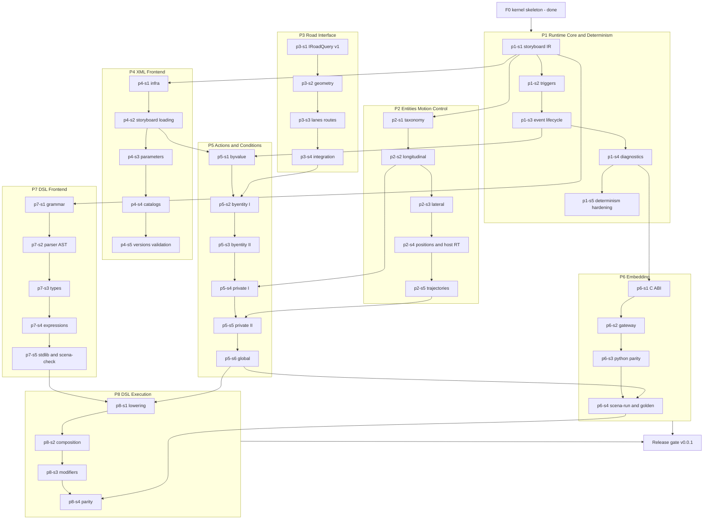

# Scena roadmap — Road to v0.0.1

This is the master plan from the completed F0 kernel skeleton to the first
public release, **v0.0.1**. It supersedes the earlier F-phase sketch: the
F-gates of ADR-0001 remain the coarse sequence (F1 ≈ P1–P6, F2 ≈ P7,
F3 ≈ P8), but the executable plan is the pillar → sprint → PR → gate
structure below. The roadmap decision itself is recorded in
`docs/architecture/ADR-0004-road-to-v001.md`.

Execution is tracked on GitHub — one milestone and one epic issue per
pillar, one issue per sprint (as sub-issues of their epic), and a project
board. The full markdown ↔ GitHub map lives in
`docs/roadmap/tracking.md`.

## Vision recap

Scena is a library-first, embeddable scenario execution engine: a C++20
kernel with a stable C ABI and Python bindings, executing ASAM OpenSCENARIO
XML (1.0–1.3) and ASAM OpenSCENARIO DSL (2.x, concrete scenarios) through
**two frontends compiling into one Scenario IR**, run by a single
deterministic step-based runtime in which the host simulator owns the clock
and each entity is either engine-controlled or host-controlled (ADR-0001,
ADR-0003). The moat is **standards correctness and determinism** —
implemented clean-room from the ASAM texts only (ADR-0002).

## Single-release philosophy

There is exactly **one release on this roadmap: v0.0.1**, published only
when all eight pillars are complete and the release gate (§Release gate)
passes. No intermediate releases, tags, or version bumps; development builds
are unversioned. Work is organized as **pillar → sprint → PR → gate**:
every sprint closes via one focused PR merged with CI green; every
behavioral promise maps to an automated test or an explicit
maintainer-executed check. Releases, tags, milestones, and issues are
created exclusively by the maintainer (`scripts/roadmap-gh-seed.sh` is a
reviewable script the maintainer runs personally).

## How to read a sprint

Each sprint lists: **Goal**, **Deliverables** (split kernel / frontend /
bindings where it applies), **Tests** (named suites; C++ suites live in
`core/tests/` or the component's `tests/` dir, GoogleTest; Python suites in
`python/tests/`, pytest), **Docs**, and **Exit criteria** (objectively
checkable: named tests green in CI, or an explicit maintainer action).
Sprints are sized for a single focused PR. Spec citations use the section
numbering of ASAM OpenSCENARIO XML 1.4.0 and ASAM OpenSCENARIO DSL 2.2.0
(the local reference copies); the fine-grained per-element mapping lives in
the coverage matrices (`docs/roadmap/coverage/`).

## Dependency graph and critical path

**Critical path** (13 sprints): p1-s1 → p1-s2 → p1-s3 → p2-s2 → p5-s4 →
p5-s5 → p5-s6 → p6-s4 → p8-s1 → p8-s2 → p8-s3 → p8-s4 → release gate.

**Ordering rationale.** Runtime semantics and the XML execution path
(P1–P6) come first: they carry the highest semantic risk, they are what
every later feature stands on, and they produce the first visibly working
engine (golden scenarios GS-1…GS-11) long before the DSL exists. P1 leads
because the storyboard hierarchy reshapes the IR — the contract every other
pillar codes against — so it must stabilize before frontends (P4, P7) and
semantics (P5) build on it. P4 starts immediately after p1-s1 and proceeds
**in parallel** with P2/P3, so parser fixtures exist by the time P5 needs
them. P3 is deliberately early-scoped and small: p3-s1 freezes `IRoadQuery`
so P2/P5 can code against the interface while the reference backend
(p3-s2/s3) matures alongside. P7 is intentionally independent of the
runtime (grammar → AST → types) and can interleave with P5/P6 whenever
frontend work would otherwise block; but its output only meets the runtime
in P8, after execution semantics are proven on XML — that sequencing is the
main risk-burn-down decision of this roadmap. P6 grows continuously (the C
ABI/bindings parity rule applies to every public API change, per
CONTRIBUTING), with its sprints marking the points where the embedding
surface must be complete and the golden harness goes live.

## Top technical risks

| # | Risk | Retired by |
|---|------|-----------|
| R1 | **Cross-platform bit-identical determinism.** Transcendental libm functions (`sin`, `cos`, `atan2`, `exp`) are not bit-identical across platforms/compilers; naive use in dynamics or geometry breaks the core promise. | p1-s5 introduces the deterministic math layer (`detmath`) and the cross-platform trace-replay CI job; every numeric kernel in P2/P3 builds on it; final proof GS-14 at release scale. |
| R2 | **DSL type system and behavior-composition semantics complexity** (DSL §7.3, §7.6 — trace-acceptance semantics with no prescribed operational semantics). | p7-s3/p7-s4 (types, expressions on the full standard library), p8-s2 (operational semantics whose traces satisfy §7.6 acceptance, tested against spec-derived cases); scope contained to concrete scenarios (ADR-0004). |
| R3 | **Trajectory numerical fidelity** (clothoid Fresnel evaluation, NURBS basis stability, arc-length parameterization). | p2-s5 with analytic ground-truth tests; GS-7 checkpoints at 1e-9 tolerance. |
| R4 | **Road backend scope creep / geometry correctness.** An OpenDRIVE reader can absorb unbounded effort. | p3-s1 freezes a minimal `IRoadQuery`; p3-s2/s3 declare a closed geometry subset (scope-out list in P3); GS-8 bounds required capability. |
| R5 | **XML↔DSL execution parity** — the IR may bake in XML-shaped assumptions the DSL cannot target. | IR review in p1-s1 explicitly checks DSL lowerability (composition operators, modifiers); p8-s1 lowering; GS-12 requires bit-identical parity. |

---

## P1 — Runtime Core & Determinism

**Objective.** Replace the F0 flat condition/action list with the full ASAM
OpenSCENARIO storyboard execution model — Story/Act/ManeuverGroup/Maneuver/
Event/Action lifecycle and state machines, trigger and condition-group
evaluation, event priority rules — on a deterministic fixed-step scheduler
with a structured diagnostics and error model (XML §7 components, §8
runtime behavior).

**Scope in:** storyboard element state machine (standby/running/complete
with start/end/stop/skip transitions per XML §8.1–8.2); Trigger = OR over
ConditionGroups, group = AND over Conditions (§7.6.1) with edge and delay
semantics (§7.6.2–7.6.4); event priority and `maximumExecutionCount`
(§7.3.2, §8.3.3.2); init-action phase before simulation time (§8.5);
storyboard stop trigger (completes only via stop trigger, §8.4.7);
action-conflict resolution (§7.5); deterministic scheduler; structured
diagnostics and error model; deterministic math layer; replay harness.
**Scope out:** the concrete condition/action catalog (P5), entity dynamics
(P2), any frontend.

**Dependencies:** F0 only. Feeds every other pillar.

**Pillar exit criteria:** all P1 sprints merged; storyboard semantics tests
(`storyboard_test`, `trigger_test`, `event_priority_test`) green on all
platforms; determinism replay CI job comparing traces across the three OS
runners green; diagnostics carry severity + location + rule ID.

### p1-s1 — Full storyboard IR & element state machines

- **Goal:** IR and runtime for the real storyboard hierarchy with the
  standard's element state machine.
- **Deliverables.** Kernel: `ir/storyboard.h` (Storyboard → Story → Act →
  ManeuverGroup (actors) → Maneuver → Event → Action nesting per XML
  §7.2.1/§7.3); element state machine per §8.1–8.2 (standby, running,
  complete; start/end/stop/skip transitions observable for
  storyboard-state conditions); child start rule per §8.3 (children with a
  start trigger enter standby, others go straight to running); init-action
  phase per §8.5 (runs before simulation time starts; non-instantaneous
  init actions carry into the storyboard); storyboard completion only via
  stop trigger (§8.4.7); engine walks the hierarchy each step; explicit IR
  lowerability review against DSL composition concepts (serial/parallel/
  one_of, DSL §7.3.13 — risk R5). Bindings: minimal builder surface in C
  ABI/Python kept compiling (full expansion lands in P6).
- **Tests:** `storyboard_test.cpp` (state transitions, hierarchy walk
  order, completeness propagation child→parent, init-phase ordering);
  determinism suite extended to hierarchical storyboards.
- **Docs:** `docs/user-guide/` storyboard model section; `engine.h` step
  order comment updated (ADR-level contract unchanged).
- **Exit:** named tests green on all platforms; F0 flat-storyboard API
  removed; determinism suite green.

### p1-s2 — Triggers, condition groups & edge semantics

- **Goal:** Standard-faithful trigger evaluation.
- **Deliverables.** Kernel: `ir::Trigger` (OR of ConditionGroups; group =
  AND of Conditions per XML §7.6.1; empty trigger always false), condition
  edges none/rising/falling/risingOrFalling with the §7.6.4 corner cases
  (first-ever evaluation of an edge condition is false; evaluation begins
  on entering standby), delay semantics per §7.6.3 (delayed condition
  evaluates the expression state of t−Δt; false while t < Δt; Δt ≥ 0
  enforced with rule `asam.net:xosc:1.0.0:data_type.condition_delay_not_
  negative`), start triggers only on Act and Event, stop triggers only on
  Storyboard and Act with descendant inheritance and execution-count
  clearing (§7.6.1.1–7.6.1.2).
- **Tests:** `trigger_test.cpp` (edge matrix × delay × group combinations,
  exact-step firing, empty-trigger and first-evaluation corner cases);
  scheduler tests for delay ordering ties (deterministic tie-break
  documented).
- **Docs:** user-guide trigger semantics section with spec citations.
- **Exit:** trigger test matrix green; delayed-condition determinism case
  in `determinism_test` green.

### p1-s3 — Event lifecycle, priority & overwrite rules

- **Goal:** Correct concurrent-event behavior inside a maneuver.
- **Deliverables.** Kernel: event priority per XML §7.3.2/§8.4.2.2 —
  literals `override` (stops all running events in the same Maneuver),
  `skip` (event never leaves standby; the skipTransition counts as an
  execution), `parallel`; the deprecated literal `overwrite` accepted at
  load time as a synonym for `override` (pre-1.3 spelling; the coverage
  matrix records the compatibility decision); `maximumExecutionCount`
  sequential re-execution per §8.3.3.2/§8.4.2.1 (executions =
  startTransitions + skipTransitions; stop trigger cancels remaining
  counts); action-conflict resolution per §7.5 (conflicting control
  strategy on the same domain/entity stops the older action; bulk actions
  over resolved ManeuverGroup actors per §7.5.4/§8.3.3.3: complete when
  all children complete, conflict on one entity overrides for all).
- **Tests:** `event_priority_test.cpp` (override kills running action same
  step; skip counts executions; parallel coexists; rerun counting; bulk
  actor conflict propagation), storyboard restart cases.
- **Docs:** user-guide event semantics; coverage matrix rows flip to
  implemented.
- **Exit:** priority matrix tests green on all platforms.

### p1-s4 — Structured diagnostics & error model

- **Goal:** One diagnostics system for frontends and runtime; no exceptions
  across any boundary.
- **Deliverables.** Kernel: `scena::Diagnostic` {severity, code, message,
  source location (file/line/xpath-ish), optional `asam.net:` rule ID},
  `DiagnosticSink` collected per load/run; `Status` extended (ParseError,
  ValidationError, SemanticError, UnsupportedFeature); engine emits runtime
  diagnostics (e.g. action on missing entity) instead of failing silently.
  Bindings: diagnostics readable through the C ABI (stable struct +
  iteration) and Python.
- **Tests:** `diagnostics_test.cpp`, `capi_test` extension (ABI diagnostic
  round-trip), pytest `test_diagnostics.py`.
- **Docs:** user-guide error-handling chapter; capi-and-bindings notes.
- **Exit:** all fallible paths return `Status` + diagnostics; ABI check
  green; sanitizer job green.

### p1-s5 — Determinism hardening & replay harness

- **Goal:** Make the bit-identity promise mechanically enforced before the
  numeric pillars build on it (risk R1).
- **Deliverables.** Kernel: `runtime/detmath.h` — the only sanctioned
  transcendental/rounding entry points for runtime code (platform-stable
  implementations, no `-ffast-math`, FMA policy fixed and documented);
  CI-enforced guard forbidding raw `<cmath>` transcendentals in
  `core/src/runtime` and `core/src/ir`; trace recorder (binary-exact state
  dump per step) in the test support library; CI job `determinism-cross`
  that runs a fixture set on all three OS runners and diffs traces
  bit-exactly.
- **Tests:** `detmath_test.cpp` (value pinning against hex-float
  references), `determinism_test` extended to long-horizon accumulation.
- **Docs:** determinism contract page in the user guide (including what
  hosts must uphold, per ADR-0003).
- **Exit:** `determinism-cross` CI job green; detmath guard active;
  hex-pinning tests green on macOS/Linux/Windows.

## P2 — Entities, Motion & Control

**Objective.** The standard's entity taxonomy and the motion machinery
scenario actions steer: longitudinal/lateral dynamics with documented
simplifications, default engine controllers, host-controlled round-trip,
position resolution, and trajectory following (XML §6 concepts + §7.2.2
entities, trajectory model §6.9).

**Scope in:** Vehicle/Pedestrian/MiscObject with bounding boxes,
performance limits, categories and properties; transition-dynamics shapes;
speed profiles; lane-change lateral shapes; teleport; position-type
resolution framework for all ten position variants (§6.3.8); polyline/
clothoid/NURBS trajectory following (§6.9); host-controlled state
round-trip semantics. **Scope out:** `ExternalObjectReference` entities,
trailers (connect/disconnect, hitch model), appearance/animation, axle-level
vehicle dynamics (documented simplification: kinematic point/single-track
models), weather/environment physics coupling.

**Dependencies:** p1-s1 (IR shape). p2-s4 uses p3-s1's interface for
road-relative positions (world/relative positions do not wait on P3).

**Pillar exit criteria:** all P2 sprints merged; motion suites green
including hex-pinned dynamics tests through `detmath`; GS-1 executable
end-to-end through the C++ API (pre-CLI).

### p2-s1 — Entity taxonomy, bounding boxes & performance

- **Goal:** Real entity model in the IR.
- **Deliverables.** Kernel: `ir::Vehicle`/`ir::Pedestrian`/`ir::MiscObject`
  (categories, bounding box center+dimensions, `Performance` limits
  (maxSpeed/maxAcceleration/maxDeceleration), axles as data, ordered
  properties map), entity table keyed by stable order (`std::map` stays);
  `EntityState` extended to a full pose (pitch/roll) with documented
  conventions (Z-up, radians, per the standards skill). Bindings: entity
  metadata queries (C ABI + Python) updated in the same PR.
- **Tests:** `entity_model_test.cpp`; `capi_test`/pytest metadata
  round-trip.
- **Docs:** user-guide entity model page.
- **Exit:** suites green; ABI/bindings/example updated in the same PR (per
  CONTRIBUTING rule).

### p2-s2 — Longitudinal dynamics & default controller

- **Goal:** Speed control with standard transition dynamics, clamped by
  performance limits.
- **Deliverables.** Kernel: transition-dynamics evaluator (shapes linear,
  cubic, sinusoidal, step; dimensions time, distance, rate per the XML
  TransitionDynamics model, §7.4.1.2), longitudinal integrator through
  `detmath`, default controller applying target-speed setpoints, speed
  profile follower (entry series with optional acceleration/jerk limits),
  documented simplification note (point-mass longitudinal model).
- **Tests:** `longitudinal_test.cpp` (each shape × dimension against
  closed-form references, performance clamping, zero-duration edge cases).
- **Docs:** user-guide motion chapter §longitudinal, simplifications table.
- **Exit:** shape/dimension matrix green on all platforms; determinism
  suite extended with a dynamics-heavy fixture.

### p2-s3 — Lateral dynamics & lane-change shapes

- **Goal:** Lateral motion machinery for lane change / lane offset /
  lateral distance.
- **Deliverables.** Kernel: lateral offset controller and lane-change
  trajectory generation over the same transition-dynamics shapes
  (time/distance dimensions), target-lane resolution against the p3-s1
  interface, heading blending rules documented; documented simplification
  (kinematic lateral model, no tire dynamics).
- **Tests:** `lateral_test.cpp` (shape sweeps, lateral overshoot bounds,
  combined longitudinal+lateral stepping determinism).
- **Docs:** user-guide motion chapter §lateral.
- **Exit:** named suites green; hex-pinned lateral trace fixture green
  cross-platform.

### p2-s4 — Position resolution, teleport & host round-trip

- **Goal:** One resolver for all position types; airtight control-ownership
  semantics.
- **Deliverables.** Kernel: `PositionResolver` mapping the ten IR position
  variants (world, relative-world, relative-object, road, relative-road,
  lane, relative-lane, route, trajectory, geographic per XML §6.3.8) to
  world poses — road-family resolution via `IRoadQuery` (p3-s1), others
  self-contained; the corrected ≥1.3 position/orientation calculations
  applied uniformly to all input versions (per XML §5, which prescribes
  exactly that); orientation reference handling (absolute/relative);
  `TeleportAction` runtime; host-controlled entities: `report_state`
  round-trip formalized (engine never integrates them; conditions observe
  reported states; publish/poll order per ADR-0003 re-verified).
  GeoPosition resolves only when a geodetic datum is available, else a
  rule-cited diagnostic (`asam.net:xosc:1.1.0:positioning.geodetic`).
- **Tests:** `position_test.cpp` (each variant, orientation composition),
  `control_ownership_test.cpp` (round-trip, mode violations).
- **Docs:** user-guide positions page.
- **Exit:** all position variants resolve or return `UnsupportedFeature`
  diagnostics (none silently wrong); suites green.

### p2-s5 — Trajectory following: polyline, clothoid, NURBS

- **Goal:** The standard's trajectory shapes with numerical fidelity
  (risk R3).
- **Deliverables.** Kernel: trajectory representation in IR (shape +
  `TimeReference`), arc-length parameterization, polyline interpolation,
  clothoid evaluation (Fresnel via `detmath`, documented approximation
  with error bound), NURBS evaluation (de Boor through `detmath`),
  following modes (follow/position) and timing (none/timing) per XML
  §6.9.1–6.9.5. ClothoidSpline and the 1.4 Motion/Interpolation additions
  are out (see coverage matrix).
- **Tests:** `trajectory_test.cpp` (analytic circles/straights as NURBS
  and clothoid degenerate cases, hex-pinned samples, arc-length round-trip
  error bounds), determinism fixture with a follower.
- **Docs:** motion chapter §trajectories incl. the coverage decision and
  numerical method notes.
- **Exit:** analytic-reference tests within 1e-9 on all platforms;
  bit-identical traces cross-platform.

## P3 — Road Interface

**Objective.** Finalize `IRoadQuery` (lane-relative positioning, s/t
coordinates, lane queries, road/lane ↔ world conversions, routes) and
provide a reference backend implementing it over ASAM OpenDRIVE input, so
road/lane positions work in actions and conditions (ADR-0003 boundary;
OpenDRIVE s/t conventions).

**Scope in:** frozen `IRoadQuery` v1; OpenDRIVE reader for planView
geometry (line, arc, spiral, poly3, paramPoly3), lane sections with widths
and ids, lane linkage, junction connectivity sufficient for routing;
world↔road/lane conversions; route representation + deterministic
shortest-path routing. **Scope out (post-v0.0.1):** elevation/
superelevation/crossfall (flat-world assumption, diagnosed), lane offsets
beyond width records, signals/objects parsed from the map file (signal
*state* lives in the scenario layer, p5-s6), OpenCRG, geo-referencing.

**Dependencies:** p1-s4 diagnostics (reader warnings). The OpenDRIVE spec
text must be fetched (`--std opendrive`) before p3-s2 starts (maintainer
action — open question OQ-3).

**Pillar exit criteria:** all P3 sprints merged; conversion round-trip and
route tests green; hand-authored map fixtures (straight, curve, junction)
committed; the runtime consumes roads **only** through `IRoadQuery`.

### p3-s1 — IRoadQuery v1: the frozen road interface

- **Goal:** Freeze the interface P2/P5 code against (unblocks parallel
  work; contains risk R4).
- **Deliverables.** Kernel: extended `gateway::IRoadQuery` — lane
  existence/width/type queries, s-range queries, lane-relative ↔ world
  conversions, relative-lane arithmetic (lane ±n at s), route interface
  (waypoints → ordered road/lane spans, position-along-route); documented
  unsupported-reporting semantics; a `FlatWorldRoadQuery` null object for
  road-free scenarios.
- **Tests:** `road_query_contract_test.cpp` — an executable contract suite
  any backend must pass (runs against `FlatWorldRoadQuery` now, the
  OpenDRIVE backend later).
- **Docs:** ADR-0003 amendment note (interface v1), user-guide road page.
- **Exit:** interface merged with contract suite green; downstream sprints
  reference only this header.

### p3-s2 — OpenDRIVE backend: reference-line geometry

- **Goal:** Parse OpenDRIVE and evaluate reference-line geometry exactly.
- **Deliverables.** New component `roads/opendrive/` (separate library
  target; the core never links it — hosts inject it via the gateway): XML
  reading via the approved parser dependency (shared with P4), planView
  geometry evaluation (line/arc/spiral/poly3/paramPoly3) through `detmath`,
  s-parameterization, inertial↔track (s,t) conversion for the reference
  line; structured diagnostics for unsupported map features (never
  silent).
- **Tests:** `opendrive_geometry_test.cpp` (hex-pinned analytic fixtures
  per geometry primitive, round-trip world↔track).
- **Docs:** roads page: supported OpenDRIVE subset table.
- **Exit:** geometry suite green cross-platform; unsupported-feature
  diagnostics verified.

### p3-s3 — Lanes, lane sections & routes

- **Goal:** Lane model + routing over the road graph.
- **Deliverables.** Lane sections, ids, polynomial width records, lane
  linkage across sections/roads, junction connections; `IRoadQuery`
  implementation completed over this model incl. lane queries and
  relative-lane arithmetic; deterministic shortest-path routing (ordered
  adjacency, documented tie-break) producing the p3-s1 route
  representation.
- **Tests:** the backend passes `road_query_contract_test` fully;
  `opendrive_lanes_test.cpp`; `route_test.cpp` (junction map fixture,
  tie-break determinism).
- **Docs:** roads page extended (lane id conventions: negative right,
  positive left, 0 = reference line, per OpenDRIVE).
- **Exit:** contract suite green against the real backend; route fixtures
  green.

### p3-s4 — Road-based positions in actions & conditions

- **Goal:** Wire roads into the execution path.
- **Deliverables.** Kernel: `PositionResolver` road/lane/route variants
  fully live against the backend; lane-change target resolution (p2-s3)
  uses lane queries; the distance-measurement plumbing P5 needs
  (longitudinal/lateral distance in road coordinates vs cartesian, per the
  XML §6.4 distance definitions and the `coordinateSystem`/
  `relativeDistanceType` attributes, with the deprecated `alongRoute`
  mapped onto them).
- **Tests:** `road_integration_test.cpp` (fixtures on the hand-authored
  maps driving road-relative teleports and lane changes), determinism
  fixture on the curve map.
- **Docs:** positions page updated with road-backed examples.
- **Exit:** integration fixtures green; GS-8's map prerequisites committed.

## P4 — OpenSCENARIO XML Frontend

**Objective.** A full loader for OpenSCENARIO XML 1.0–1.3 within the
declared coverage matrix: document reading, storyboard/entities lowering to
IR, parameters and expressions, catalogs, variables, init actions, entity
selections, controller assignment, file-level validation with structured
warnings, and documented version migration (XML §6–§9; coverage:
`docs/roadmap/coverage/osc-xml-coverage.md`).

**Scope in:** everything the coverage matrix marks In-v0.0.1, parsed and
lowered; structured `UnsupportedFeature` warnings (never silent drops) for
everything else, per the parsing rules of the standards skill. **Scope
out:** XSD-driven validation (the normative XSD ships only in ASAM's gated
bundle — validation is schema-informed and hand-built; open question OQ-4),
stochastic `ParameterValueDistribution` files, 1.4-only elements (rejected
by version detection).

**Dependencies:** p1-s1 (IR), p1-s4 (diagnostics). The XML parser
dependency needs maintainer license approval before p4-s1 (open question
OQ-1).

**Pillar exit criteria:** all P4 sprints merged; conformance fixture corpus
(spec-derived, self-authored) loads with expected IR snapshots; diagnostics
cite `asam.net:xosc` rule IDs where defined; version matrix tests green.

### p4-s1 — XML infrastructure: parsing, versions, diagnostics

- **Goal:** Deterministic, locale-safe document layer.
- **Deliverables.** Frontend: approved XML parser dependency pinned
  (`cmake/Dependencies.cmake` + `THIRD_PARTY_LICENSES.md` in the same
  commit); binary-mode CRLF-safe reading; `std::from_chars`-only numeric
  conversion helpers (cross-platform rule); `FileHeader`
  revMajor/revMinor detection (1.0–1.3 accepted; 1.4 rejected with a
  diagnostic; unknown → error); xpath-ish source locations on every
  diagnostic; loader API (`xml::load(path|string) → {Scenario IR,
  diagnostics}`).
- **Tests:** `xml_infra_test.cpp` (encodings, CRLF, the comma-decimal
  locale trap as a dedicated test, version matrix).
- **Docs:** user-guide "loading scenarios" page.
- **Exit:** infra suite green incl. locale case on all platforms;
  dependency approved and pinned.

### p4-s2 — Entities, storyboard & init loading

- **Goal:** The structural spine: `.xosc` → IR.
- **Deliverables.** Frontend: `ScenarioDefinition` skeleton, `Entities`
  (inline Vehicle/Pedestrian/MiscObject → p2-s1 IR), `Storyboard`
  hierarchy incl. triggers/edges/delays (→ p1-s1/s2 IR), `Init` actions
  (global + private, §8.5 ordering), stop trigger; action/condition
  payload lowering for everything P5 has landed so far, structured
  `UnsupportedFeature` warnings for the rest (matrix-driven);
  `RoadNetwork` element (logic file reference handed to the host/road
  backend).
- **Tests:** `xml_storyboard_test.cpp` with IR-snapshot fixtures
  (self-authored from spec examples); round-trip invariant: load →
  IR dump → stable snapshot.
- **Docs:** coverage matrix status flips.
- **Exit:** snapshot suite green; the GS-1 file loads and runs through the
  C++ API.

### p4-s3 — Parameters, expressions & variables

- **Goal:** The reuse machinery that makes real-world files load.
- **Deliverables.** Frontend: `ParameterDeclaration` scoping and
  `ValueConstraint` groups per XML §9.1, `$`-references, `${...}`
  expression evaluation per §9.2 (operator whitelist, constants, typing,
  NaN/overflow rejection per the `asam.net:xosc:1.1.0:expressions.*`
  rules; the 1.4-only constant `pi` rejected for 1.0–1.3), parameter type
  checking, `ParameterAssignments` at reference sites. Kernel: runtime
  variable store (`VariableDeclaration`, §6.12 — variables are runtime
  state, not expression inputs).
- **Tests:** `xml_expression_test.cpp` (operator/precedence matrix, error
  diagnostics citing rule IDs), `variable_store_test.cpp` (kernel).
- **Docs:** parameters page in the user guide.
- **Exit:** expression matrix green; diagnostics carry rule IDs.

### p4-s4 — Catalogs, entity selections & controllers

- **Goal:** Cross-file reuse and controller assignment.
- **Deliverables.** Frontend: `CatalogLocations` directory scanning with
  deterministic file ordering, catalog loading and reference resolution
  with `ParameterAssignments` for the eight 1.0–1.3 catalog types
  (vehicle, controller, pedestrian, miscObject, environment, maneuver,
  trajectory, route — §9.4–9.6), `EntitySelection` (explicit members and
  by-type, §7.2.2.2–7.2.2.5, homogeneity rules cited), `ObjectController`
  assignment lowering to control-ownership + controller metadata
  (engine-controlled default vs host-declared, mapping documented per
  ADR-0003 and §6.6).
- **Tests:** `xml_catalog_test.cpp` (multi-file fixtures, missing-ref
  diagnostics with rule IDs, parameterized catalog entries),
  `xml_selection_test.cpp`.
- **Docs:** catalogs page; controller-mapping note in gateway docs.
- **Exit:** catalog fixture tree loads reproducibly (filesystem
  enumeration order does not affect the IR); suites green.

### p4-s5 — 1.0–1.3 migration & file-level validation

- **Goal:** Honest multi-version support and a strict validation story.
- **Deliverables.** Frontend: per-version acceptance rules (1.3's
  corrected position semantics applied to all versions per §5; deprecated
  constructs of the coverage matrix accepted with warnings — deprecated
  `ActivateControllerAction` placement, `ParameterSetAction`/
  `ParameterModifyAction`, `ReachPositionCondition`, `alongRoute`,
  priority `overwrite`); file-level validation pass (referential
  integrity: entity refs, storyboard-element refs, catalog refs;
  cardinalities; unused-declaration warnings) with rule-ID citations;
  `scena::xml::validate()` API (load + check without executing).
- **Tests:** `xml_version_test.cpp` (the same scenario expressed per
  1.0/1.1/1.2/1.3 → equivalent IR or documented divergence),
  `xml_validate_test.cpp` (each validation rule has a red fixture).
- **Docs:** `docs/user-guide/xml-versions.md` migration table (the
  documented version-migration handling).
- **Exit:** version/validation suites green; migration table published.

## P5 — Actions & Conditions Semantics

**Objective.** Implement the declared action and condition catalog against
the coverage matrix — every implemented item cross-referenced to its spec
section and its tests (XML §7.4 actions, §7.5 conflicts, §7.6 conditions;
matrix: `docs/roadmap/coverage/osc-xml-coverage.md`).

**Scope in (headline; the matrix is normative):** private actions —
SpeedAction, SpeedProfileAction, LongitudinalDistanceAction,
LaneChangeAction, LaneOffsetAction, LateralDistanceAction, TeleportAction,
AssignRouteAction, FollowTrajectoryAction, AcquirePositionAction,
ActivateControllerAction (incl. deprecated placement), AssignControllerAction
(metadata + host handoff), VisibilityAction (state flag surfaced to host);
global actions — ParameterSetAction/ParameterModifyAction (deprecated,
lowered onto the variable store), VariableSetAction/VariableModifyAction,
AddEntityAction/DeleteEntityAction, EnvironmentAction (state store +
time-of-day clock; no physics coupling, documented),
TrafficSignalStateAction, TrafficSignalControllerAction;
CustomCommandAction as a host callback. Conditions — all ByValue
(SimulationTime, Parameter, Variable, StoryboardElementState,
UserDefinedValue, TimeOfDay, TrafficSignal, TrafficSignalController) and
the ByEntity set: Speed, RelativeSpeed, Acceleration, StandStill,
TraveledDistance, ReachPosition (deprecated, accepted), Distance,
RelativeDistance, TimeHeadway, TimeToCollision, EndOfRoad, Offroad,
Collision, RelativeClearance — with TriggeringEntities any/all.
**Scope out (post-v0.0.1, reasons in the matrix):** SynchronizeAction,
OverrideControllerValueAction, traffic source/sink/swarm/area/stop,
appearance actions (Animation, LightState), trailers, monitors
(SetMonitorAction), RandomRouteAction, Angle/RelativeAngle conditions,
all 1.4-only items.

**Dependencies:** p1-s3 (lifecycle), P2 (motion machinery per action
family), p3-s4 (road-based measures), p4-s2 (fixtures load).

**Pillar exit criteria:** every matrix row marked In-v0.0.1 has a runtime
implementation, a named test, a loading path from XML, and a spec-section
citation in code; per-family determinism fixtures green.

### p5-s1 — ByValue conditions

- **Goal:** The by-value condition set (signal conditions follow with
  their actions in p5-s6).
- **Deliverables.** Kernel: SimulationTime (time starts with the
  storyboard running, §8.4.7), Parameter, Variable, UserDefinedValue
  (host-provided named values), TimeOfDay, and StoryboardElementState
  conditions (states **and** transitions observed, wired to the p1-s1
  state machine, §7.6.5.2); the Rule comparator (equal/greater/less
  family) as one shared component with documented numeric/string
  semantics. Frontend: lowering for each.
- **Tests:** `condition_byvalue_test.cpp` (per-condition semantics ×
  edges × delays), storyboard-state observation fixtures.
- **Exit:** suite green; matrix rows flipped with citations.

### p5-s2 — ByEntity conditions I: kinematics & position

- **Goal:** Entity-observing conditions with correct triggering-entity
  semantics.
- **Deliverables.** Kernel: `TriggeringEntities` any/all evaluation frame
  (§7.6.5.1), Speed (optional direction), RelativeSpeed, Acceleration,
  StandStill (duration accumulation), TraveledDistance, ReachPosition
  (deprecated; position + tolerance via `PositionResolver`) conditions;
  road-coordinate vs cartesian measurement plumbing from p3-s4.
- **Tests:** `condition_byentity_kinematics_test.cpp` (incl. observation
  of host-controlled entities).
- **Exit:** suite green; any/all matrix covered.

### p5-s3 — ByEntity conditions II: interaction metrics

- **Goal:** The interaction measures scenarios actually trigger on.
- **Deliverables.** Kernel: Distance and RelativeDistance
  (coordinateSystem × relativeDistanceType per §6.4, freespace true/false
  using p2-s1 bounding boxes, deprecated `alongRoute` mapped),
  TimeHeadway, TimeToCollision (documented closed-form: distance over
  closing speed, no acceleration term, diverging ⇒ false), EndOfRoad,
  Offroad (road-network-dependent, rule `asam.net:xosc:1.0.0:...` road
  prerequisite cited), Collision (OBB intersection), RelativeClearance
  (adjacent-lane/longitudinal-window freeness). Freespace math through
  `detmath`.
- **Tests:** `condition_byentity_interaction_test.cpp` (analytic gap
  fixtures, freespace vs reference-point, TTC edges: diverging, zero
  relative speed).
- **Exit:** suite green cross-platform (freespace math hex-pinned).

### p5-s4 — Private actions I: longitudinal, lateral, teleport

- **Goal:** The core motion actions end-to-end (XML → IR → runtime →
  trace).
- **Deliverables.** Kernel: SpeedAction (absolute/relative targets,
  `continuous=true` relative tracking never ends per §7.5.3, step shape =
  instantaneous; replaces the F0 placeholder), SpeedProfileAction,
  LaneChangeAction (absolute/relative targets, offset carryover),
  LaneOffsetAction (continuous variant), LateralDistanceAction,
  TeleportAction over all position types. Frontend lowering for each;
  event-priority interaction with running motion actions verified
  (conflict rules §7.5).
- **Tests:** `action_longitudinal_test.cpp`, `action_lateral_test.cpp`,
  overwrite-during-transition fixtures; GS-2's core sequence as an engine
  test.
- **Exit:** suites green; GS-1/GS-2 scenario bodies run via the C++ API
  with stable traces. *(Met partially as of p5-s4: the longitudinal set —
  SpeedAction absolute/relative targets with continuous tracking, minimal
  §7.5.1 single-domain supersession — and the world-frame TeleportAction
  landed (ADR-0013), with GS-1 running as an engine test and determinism
  anchor. The lateral trio — LaneChangeAction, LaneOffsetAction,
  LateralDistanceAction — and `action_lateral_test.cpp` need the p2-s3
  lateral machinery (#17) and p3-s4 lane resolution (#23), so they move
  with those sprints, and GS-2 moves with them; full §7.5 conflict
  resolution is carried by #51 and XML lowering by P4. The coverage
  matrix's Tests column tracks each row's carrier.)*

### p5-s5 — Private actions II: routing, distance keeping & controllers

- **Goal:** Path-level control and the controller/visibility surface.
- **Deliverables.** Kernel: AssignRouteAction (§6.8.2),
  AcquirePositionAction (implicit route), FollowTrajectoryAction (p2-s5
  machinery; timeReference × followingMode matrix per §6.9),
  LongitudinalDistanceAction (distance/timeGap modes, freespace,
  constraints from performance limits, `continuous` keeping),
  ActivateControllerAction (per-domain toggling of the engine default
  controller; deprecated direct placement accepted),
  AssignControllerAction (controller metadata handed to the host via
  gateway), VisibilityAction (graphics/sensors/traffic flags surfaced
  through state/gateway). Frontend lowering for each.
- **Tests:** `action_routing_test.cpp`, `action_distance_test.cpp`
  (convergence bounds, freespace hold), controller/visibility round-trip
  tests.
- **Exit:** suites green; GS-4/GS-7/GS-8 scenario bodies run via the C++
  API. *(Met partially as of p5-s5: GS-4 runs and is a determinism anchor;
  GS-7 needs the clothoid/NURBS shapes of p2-s5 and GS-8 the road network of
  p3-s4, so both move with those sprints — see ADR-0014 and the status notes
  in `golden-scenarios.md`.)*

### p5-s6 — Global & infrastructure actions

- **Goal:** Complete the declared catalog.
- **Deliverables.** Kernel: VariableSetAction/VariableModifyAction (add/
  multiply rules, numeric-only per rule citation) and the deprecated
  ParameterSetAction/ParameterModifyAction lowered onto the same runtime
  store for 1.0/1.1 files; AddEntityAction/DeleteEntityAction with
  deterministic entity-table updates; EnvironmentAction (environment
  state store incl. TimeOfDay clock feeding TimeOfDayCondition; no
  physics coupling, documented); TrafficSignalStateAction +
  TrafficSignalControllerAction (phase model per §6.11) with
  TrafficSignalCondition + TrafficSignalControllerCondition;
  CustomCommandAction as a gateway callback (no-op without a host).
  Frontend lowering for each.
- **Tests:** `action_global_test.cpp`, `traffic_signal_test.cpp` (phase
  timing determinism), entity add/delete determinism fixture.
- **Exit:** every In-v0.0.1 matrix row implemented + tested; matrix
  cross-checked by the docs consistency grep in CI.

## P6 — Embedding: Gateway, C API & Python

**Objective.** The embedding surface at release quality: full-engine C ABI,
mature gateway (state injection, callbacks, time sourcing), Python parity,
and the `scena-run` headless CLI that executes a scenario file and emits a
state trace (CSV/JSON) — deliberately no visualization (ADR-0001
library-first).

**Scope in:** C ABI over everything public (loading, diagnostics,
storyboard state query, entity metadata/state, variables, signals, host
report, callbacks); gateway event callbacks and time-sourcing
documentation; Python parity + examples; `scena-run` + trace formats +
golden harness. **Scope out:** GUI/visualization, concrete simulator
adapters, network transports.

**Dependencies:** p1-s4 (diagnostics ABI); grows with P2–P5; p6-s4 needs
p5-s6 (and P4) for meaningful scenarios.

**Pillar exit criteria:** parity audit table (C++ ↔ C ABI ↔ Python)
checked in with zero gaps; `scena-run` executes the golden corpus; the
capi-and-bindings review checklist passes.

### p6-s1 — C ABI expansion to the full engine surface

- **Goal:** Everything reachable from C.
- **Deliverables.** `capi/`: scenario loading
  (`scn_load_xml_file/_string`), diagnostics iteration,
  storyboard-element state query by path, entity enumeration + metadata,
  extended state struct (full pose), variable get/set, signal state
  get/set, `scn_abi_version()`; opaque handles + `SCN_*` status codes
  throughout; header stays C-clean.
- **Tests:** `capi_test.cpp` grown per function group incl. a
  null-argument rejection sweep; a pure-C consumer compile check.
- **Docs:** C API reference page regenerated.
- **Exit:** null-safety sweep green; pure-C consumer builds on all
  platforms.

### p6-s2 — Gateway maturity: callbacks & state injection

- **Goal:** Host integration beyond polling.
- **Deliverables.** Kernel: `ISimulatorGateway` v1 — batched publish/poll
  (step order guarantees unchanged per ADR-0003), storyboard event
  callbacks (element state transitions, deterministic callback order),
  custom-command callback (p5-s6 hook), road-query injection point
  formalized; time-sourcing contract documented (fixed dt, variable dt,
  zero-dt query steps). C ABI: function-pointer callback registration.
- **Tests:** `gateway_test.cpp` (callback ordering determinism, host-clock
  patterns incl. dt=0), capi callback round-trip.
- **Docs:** ADR-0003 amendment note; embedding guide page.
- **Exit:** suites green; embedding guide reviewed.

### p6-s3 — Python parity & examples

- **Goal:** Python at parity with the C++ surface.
- **Deliverables.** `python/`: bindings for every p6-s1/p6-s2 capability
  (callbacks as Python callables, GIL/reentrancy policy documented),
  typing stubs, examples `load_and_run.py`, `host_controlled.py`,
  `storyboard_events.py`; `scripts/parity_audit.py` generating the
  C++/C/Python parity table.
- **Tests:** pytest `test_loader.py`, `test_callbacks.py`,
  `test_parity.py` (audit table has no gaps).
- **Docs:** Python quickstart rewrite.
- **Exit:** parity audit gap-free; examples run in CI on all platforms.

### p6-s4 — scena-run CLI & golden harness

- **Goal:** The validation vehicle for the release gate.
- **Deliverables.** `tools/scena-run/` (thin consumer of the public API
  only): `scena-run <file> --dt --duration --trace out.{csv,json}
  --replay <entity>=<csv> --select <alt>`, bit-exact double round-trip
  formatting, exit codes (0 ok; nonzero on load/validation errors);
  `scripts/golden.py` (run + verify per
  `docs/roadmap/golden-scenarios.md`); `tests/golden/` layout with the
  XML golden set GS-1…GS-11 + GS-14 fixtures and per-platform reference
  traces; CI job `golden` on all three OS runners.
- **Tests:** CLI behavior tests (`tools/scena-run/tests/`); the golden CI
  job itself.
- **Docs:** `scena-run` reference page; golden-scenarios.md flips from
  plan to live doc.
- **Exit:** GS-1…GS-11 green in CI on all platforms (bit-identity +
  checkpoints); maintainer dry-runs the hand-execution procedure once on
  macOS.

## P7 — OpenSCENARIO DSL Frontend

**Objective.** A grammar-based parser (ANTLR4 C++ runtime, BSD), AST,
symbol resolution and type system for OpenSCENARIO DSL 2.x, able to load
and check the finalized standard library and concrete scenario files with
actionable diagnostics — shipping `scena-check` for DSL files (DSL §7;
coverage: `docs/roadmap/coverage/osc-dsl-coverage.md`).

**Scope in:** full lexical/syntactic grammar (§7.2) incl. indentation
blocks; AST; declarations and scoping; type system (§7.3: physical
types/units with SI dimension checking, enums, structs, actors, scenarios,
actions, modifiers, events, fields param/var, inheritance incl.
conditional, extension); expressions (§7.4); constraint (`keep`) and
coverage constructs (§7.5) parsed and **checked but not solved**; library
mechanisms (§7.7: namespaces, import, standard-library import forms);
loading the §8 standard library cleanly. **Scope out:** external-method
binding to host code (parsed; diagnosed as unsupported when invoked),
constraint solving (F4), any execution (P8).

**Dependencies:** p1-s4 (diagnostics); otherwise independent of P2–P6.
ANTLR4 wiring needs maintainer dependency approval before p7-s1 (open
question OQ-2: build-time generation vs vendored generated sources —
recommendation: vendor the generated parser sources so the build needs no
Java toolchain).

**Pillar exit criteria:** the DSL standard library type-checks with zero
errors; spec-annex-derived example files parse and check with precise
diagnostics (section-number citations — the DSL spec defines no rule IDs);
`scena-check` exits nonzero with actionable messages on seeded error
corpora.

### p7-s1 — DSL grammar & lexer (ANTLR4)

- **Goal:** Tokens and layout exactly per §7.2.1.
- **Deliverables.** `frontends/dsl/`: approved ANTLR4 dependency wiring;
  lexer (identifiers incl. escaped `|...|` form, physical literals with
  units, int/uint/hex/float/bool/string literals, `#` comments, line
  continuation) + indentation preprocessor (offside rule → INDENT/DEDENT,
  CRLF-safe, per §7.2.1.4); `std::from_chars` numeric conversion.
- **Tests:** `dsl_lexer_test.cpp` (token goldens incl. pathological
  indentation and unit literals).
- **Docs:** frontend README (grammar written from spec §7.2 — clean-room
  provenance note).
- **Exit:** lexer goldens green; dependency pinned + licensed.

### p7-s2 — Parser & AST

- **Goal:** Full-syntax parse to a typed AST.
- **Deliverables.** Parser for §7.2.2: type declarations (physical
  types/units, enums, structs, actors, scenarios, actions, modifiers,
  `extend`), global parameters, structured-type members (events, fields
  with `with:` blocks, `keep`/`remove_default`, methods, coverage,
  modifier applications, behavior `on`/`do` with serial/parallel/one_of,
  labels, invocation `with` blocks, `wait`/`emit`/`call`/`until`),
  argument lists, the expression grammar; AST value types with stable
  ordering + source ranges; error recovery at sync points.
- **Tests:** `dsl_parser_test.cpp` (AST snapshots for self-authored
  spec-derived files, seeded-error corpus with location assertions).
- **Exit:** snapshot + error-corpus suites green.

### p7-s3 — Symbols & type system

- **Goal:** Name resolution and the §7.3 type rules.
- **Deliverables.** Symbol tables (deterministic ordered storage),
  namespace/scoping and `::` resolution (§7.7.4), declare-anywhere
  resolution order (§7.3.15), single inheritance + conditional
  inheritance (`is()`/`as()` latent subtypes, §7.3.8), extension
  composition (§7.3.9), physical types with SI-exponent dimension
  checking and unit conversion factors/offsets (§7.3.4), enum
  (`enum!member`) typing, actor/scenario/action signature checking,
  modifier applicability (§7.3.12), `it` binding rules; diagnostics with
  §-citations.
- **Tests:** `dsl_types_test.cpp` (unit-conversion matrix, extension and
  conditional-inheritance cases, negative fixtures per rule).
- **Exit:** type-rule matrix green; a standard-library subset loads.

### p7-s4 — Expressions, constraints & coverage (check-only)

- **Goal:** §7.4 expressions everywhere they appear; §7.5 constructs
  checked, not solved.
- **Deliverables.** Expression typing + constant-context evaluation
  (arithmetic with units and the §7.4.2.3.1 conversion rules, logical
  short-circuit, relational incl. `in`, ternary, `is()`/`as()`, list and
  range operators), `keep([hard|default])` parsing + type checks +
  **concrete-value satisfiability only** (a concrete assignment violating
  a keep is an error; anything requiring search →
  `UnsupportedFeature` per ADR-0004), `sample()` fields, coverage
  (`cover`/`record`/cross) parsed + checked with an explicit
  not-collected diagnostic note.
- **Tests:** `dsl_expression_test.cpp`, `dsl_constraint_test.cpp`
  (concrete-violation red fixtures, solver-required
  unsupported-diagnostic fixtures).
- **Exit:** suites green; unsupported paths diagnose, never crash.

### p7-s5 — Standard library checking & scena-check

- **Goal:** The pillar's user-visible capability.
- **Deliverables.** Bundled standard library (`stdtypes` + `std`
  namespaces authored from the §8/§8.13–8.15 normative text — the spec's
  library *text* is normative, its files are not — clean-room, cited per
  section); full-library type-check as a test; `tools/scena-check/`:
  `scena-check <file.osc>` → diagnostics with §-citations, exit codes;
  C ABI + Python `check_dsl` entry points (parse + check only).
- **Tests:** `dsl_stdlib_test.cpp` (library loads with zero errors),
  `scena-check` CLI tests, pytest `test_dsl_check.py`.
- **Docs:** DSL user-guide page (checking workflow).
- **Exit:** standard library checks clean; `scena-check` corpus green;
  bindings updated in the same PR.

## P8 — OpenSCENARIO DSL Execution

**Objective.** Lower checked concrete DSL scenarios to the shared Scenario
IR and execute them on the same runtime as XML, with composition operators
and concrete-value modifiers, demonstrating execution parity via XML/DSL
scenario pairs with matching trajectories (DSL §7.6 semantics, §8.8
actions, §8.9 movement modifiers). The DSL spec deliberately defines
trace-acceptance rather than operational semantics (§7.6.1) — Scena's
deterministic executor is one conformant operational choice, and its
decisions are documented per section. Constraint solving and
abstract-scenario generation are **explicitly out of scope** for v0.0.1
(ADR-0004; post-release, feasibility-gated).

**Scope in:** attribute-level concrete scenario execution (DSL §6.3.1.2.1
— fixed attribute values, engine synthesizes motion); `do` composition
serial / parallel (default overlap) / one_of with a deterministic
host-selected alternative (default: first; documented — any single branch
is a valid acceptance per §7.6.2.1.3, and no randomness is permitted by
the determinism contract); `duration` bounds and `until`; events
`wait`/`emit`/`on`; the declared §8.9 modifier subset applied to the §8.8
movement actions per the coverage matrix; actor → IR entity mapping;
`set_map_file` binding to the P3 backend. **Scope out:** solving, range
selection, distributions, coverage-driven runs, external-method execution,
environment/weather DSL actions, DSL traffic-light actions (post-v0.0.1;
XML signal actions cover v0.0.1 signal needs), non-default parallel
overlap kinds and offsets.

**Dependencies:** p7-s5 (checked AST), p5-s6 (complete runtime), p6-s4
(harness for parity).

**Pillar exit criteria:** GS-12/GS-13 green (GS-12 bit-identical to its
XML twin); every DSL-execution matrix row In-v0.0.1 implemented with
tests; `scena-run` accepts `.osc` concrete scenarios.

### p8-s1 — Lowering concrete scenarios to the IR

- **Goal:** `.osc` in, Scenario IR out.
- **Deliverables.** Frontend (`frontends/dsl/lowering/`): scenario entry
  point selection (implementation-defined per §7.7.2 — top-level scenario
  by qualified name, CLI/API parameter), concrete parameter binding
  (equality/single-value `keep`s resolved at init per §7.3.11; anything
  else diagnosed), actor → IR entity mapping (vehicle/person physical
  fields → p2-s1 taxonomy), §8.8 movement-action subset (`move`, `drive`,
  `walk`, assign/change/keep speed and position family, `follow_lane`,
  `change_lane`, gap/headway keeping, `follow_path`/`follow_trajectory`
  per matrix) → IR actions, `set_map_file` → road backend wiring;
  diagnostics for non-concrete remnants (§-citations); `scena-run`
  accepts `.osc`.
- **Tests:** `dsl_lowering_test.cpp` (IR snapshots for self-authored
  spec-derived concrete scenarios; non-concrete red fixtures).
- **Exit:** snapshot suite green; a trivial DSL scenario runs end-to-end.

### p8-s2 — Composition operators: serial, parallel, one_of

- **Goal:** §7.6.2 invocation semantics on the runtime's storyboard
  machinery.
- **Deliverables.** Kernel: composition nodes mapping onto the P1
  execution model (designed for in p1-s1's lowerability review) — serial
  segmentation (member starts when predecessor ends, §7.6.2.1.2),
  parallel with default `start` overlap and all-members-complete join
  (§7.6.2.1.4), one_of deterministic selection input (engine API +
  `--select`, default first alternative, §7.6.2.1.3), `duration` bounds,
  `until` (terminates the annotated invocation exactly at the event,
  §7.6.2.5.4), `wait`/`emit`/`on` plumbed onto the trigger system
  (§7.6.2.5; emit is zero-time, wait is pure synchronization); predefined
  `start`/`end`/`fail` events (§7.3.10.3) mapped to storyboard element
  transitions.
- **Tests:** `dsl_composition_test.cpp` (phase-boundary traces per
  operator, nested compositions, event-gated phases), determinism fixture
  per alternative.
- **Exit:** operator suite green; GS-13's body runs via the API.

### p8-s3 — Movement modifiers

- **Goal:** The declared §8.9 modifier set with concrete values.
- **Deliverables.** Frontend + kernel: modifier application per §7.3.12.4
  (argument = equality constraint) compiled onto the P2/P5 motion
  machinery — in-scope set per matrix: `position`/`keep_position`,
  `speed`/`change_speed`/`keep_speed`, `acceleration`, `lane`/
  `change_lane` (side required for determinism — unspecified side is
  diagnosed, not randomized)/`keep_lane`, `lateral`, `along`/
  `along_trajectory`, `distance`; `at` phase anchoring (start/end/all,
  §8.9.19); no parallel modifier machinery in the runtime — modifiers
  lower to existing IR actions/constraints wherever expressible, with any
  kernel addition documented and spec-cited.
- **Tests:** `dsl_modifier_test.cpp` (each modifier → expected IR/trace,
  combination fixtures, conflict diagnostics).
- **Exit:** modifier matrix green; coverage matrix rows flipped.

### p8-s4 — XML↔DSL parity & DSL golden scenarios

- **Goal:** Prove two-frontends-one-runtime, literally.
- **Deliverables.** GS-12 (DSL twin of GS-2) and GS-13 fixtures +
  reference traces; parity harness (`scripts/golden.py compare-pair`)
  asserting bit-identical traces for declared pairs; DSL golden CI job;
  user-guide "one scenario, two languages" page.
- **Tests:** golden CI extended (GS-12 pair equality, GS-13
  alternatives); `dsl_parity_test.cpp` for IR-level equivalence.
- **Exit:** GS-12 bit-identical pair green on all platforms; GS-13 green;
  pillar exit review done.

---

## Release gate for v0.0.1

v0.0.1 is published only when all of the following hold:

1. All sprints of all eight pillars merged to `main` with CI green
   (macOS/Linux/Windows, warnings-as-errors, ASan+UBSan jobs).
2. All golden scenarios (GS-*) hand-executed by the maintainer on macOS,
   Linux, and Windows, with results recorded in
   `docs/roadmap/golden-scenarios-results.md`.
3. A 24-hour ASan soak (looped golden-scenario execution) completes with
   zero findings.
4. Coverage matrices, user guide, and API docs synchronized with the
   shipped behavior.
5. The maintainer gives explicit written approval — then, and only then,
   the maintainer personally tags and publishes v0.0.1 (including the
   PyPI claim of `scena`).

## Post-v0.0.1 (not planned here)

Constraint solving / abstract and logical DSL scenarios (F4,
feasibility-gated); traffic swarms and stochastic distributions;
environment/weather semantics beyond state storage; XML 1.4 targeting;
monitors; trailers; appearance (animation/lights); elevation and richer
OpenDRIVE features; external-method execution; adapters and visualization
(out of scope by ADR-0001). Each exclusion carries its reason in the
coverage matrices.
